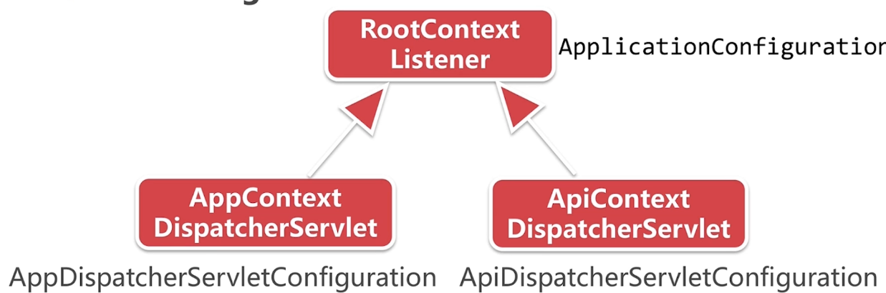

# Activiti源代码概述

#### 源码概述

1. GitHub工作原理
2. 
3. 获取Activiti源码


#### Activiti模块介绍

***

1. 核心模块
       * module/activiti-engine 核心引擎
       * module/activiti-spring Spring集成模块
       * module/activiti-spring-boot-starter SpringBoot集成模块
       * module/activiti-rest 对外提供rest api模块
       * module/activiti-form-engine 表单引擎模块
       * module/activiti-ldap 集成ldap用户集成
2. Activiti-enigne 依赖的模块


#### 基于源运行activiti-app

***

##### 培析activiti-app

1. activiti-ui

       * activiti-app 集成发布的war工程
       * activiti-app-conf UI独立于业务外的配置
       * activiti-app-logic UI的业务逻辑
       * activiti-app-rest 提供接口的rest api

   > #### WebConfigurer.java
   >
   > activiti-ui -> activiti-app 下的WEB-INF下的web.xml文件中，所用到的监听类WebConfigurer
   >
   > ```web.xml
   > <web-app xmlns="http://java.sun.com/xml/ns/javaee"
   >          xmlns:xsi="http://www.w3.org/2001/XMLSchema-instance"
   >          xsi:schemaLocation="http://java.sun.com/xml/ns/javaee http://java.sun.com/xml/ns/javaee/web-app_3_0.xsd"
   >          version="3.0"
   >          metadata-complete="true">
   > 
   >     <!--
   >      Remove classpath scanning (from servlet 3.0) in order to speed jetty startup :
   >      metadata-complete="true" above + empty absolute ordering below
   >      -->
   >     <absolute-ordering>
   >         <!--
   >            Empty absolute ordering is necessary to completely desactivate classpath scanning
   >             -->
   >     </absolute-ordering>
   > 
   >     <display-name>activiti-app</display-name>
   > 
   >     <!-- All the Servlets and Filters are configured by this ServletContextListener : -->
   >     <listener>
   >         <listener-class>org.activiti.app.servlet.WebConfigurer</listener-class>
   >     </listener>
   > </web-app>
   > ```
   >
   > **监听类是在服务启动的时候初始化，在服务停止的时候销毁。在监听类初始化过程中会构建rootContext,并注册ApplicationConfiguration，而且与servlet容器，tomcat容器进行一个双向绑定.**
   >
   > 之后又进行一个初始化Spring相关与SpringSecurity相关
   >
   > **初始化Spring：initSpring；在这个操作中创建了WebApplicationContext,注入它的父容器rootContext, 并注册了两个子容器AppDispatcherServletConfiguration，ApiDispatcherServletConfiguration**

   > 
   >
   > RootContextListener：参考了SpringMVC中的ContextLister，由ApplicationConfiguration   创建完成
   >
   > AppContextDispatcherServlet：主要对应到整个业务，暴露出来的url，由AppDispatcherServletConfiguration创建完成
   >
   > ApiContextDispatchserServlet：Activiti-Rest暴露出来的api， 由ApiDispatcherServletConfiguration创建完成

### Hello World之Activiti6.x

***

1. Activiti第一个程序Hello World

* 二级审批流程

     * 设计流程图

          * 定义二级审批流程

            

     * IDEA 创建maven工程

          * Maven标准工程结构
       * Pom依赖说明

     * 基于命令行交互的工作流小程序

       ```java
       /**
        * @ClassName DemoMain
        * @Description 启动类
        * @Author YuKai Fan
        * @Date 2019/7/23 21:20
        * @Version 1.0
        **/
       public class DemoMain {
           private static final Logger logger = LoggerFactory.getLogger(DemoMain.class);
       
           /**
            * @Description 
            *
            * @Author YuKai Fan
            * @Date 21:35 2019/7/23
            * @Param 
            * @return 
            **/
           public static void main(String[] args) throws ParseException {
               logger.info("启动程序");
               //1.创建流程引擎
               ProcessEngine processEngine = getProcessEngine();
       
               //2.部署流程定义文件
       
               //对流程定义库的操作
               ProcessDefinition processDefinition = getProcessDefinition(processEngine);
       
               //3.启动运行流程
               ProcessInstance processInstance = getProcessInstance(processEngine, processDefinition);
       
               //4.处理流程任务
               processTask(processEngine, processInstance);
               logger.info("结束程序");
           }
       
           private static void processTask(ProcessEngine processEngine, ProcessInstance processInstance) throws ParseException {
               Scanner scanner = new Scanner(System.in);
               while (processInstance != null && !processInstance.isEnded()) {
                   //处理流程任务对象taskService
                   TaskService taskService = processEngine.getTaskService();
                   List<Task> list = taskService.createTaskQuery().list();
                   for (Task task : list) {
       
                       logger.info("待处理任务 [{}]", task.getName());
                       Map<String, Object> variables = getFormMap(processEngine, scanner, task);
       
                       taskService.complete(task.getId(), variables);
                       processInstance = processEngine.getRuntimeService()
                               .createProcessInstanceQuery()
                               .processInstanceId(processInstance.getId())
                               .singleResult();
                   }
                   logger.info("待处理任务数量 [{}]", list.size());
               }
               scanner.close();
           }
       
           private static Map<String, Object> getFormMap(ProcessEngine processEngine, Scanner scanner, Task task) throws ParseException {
               FormService formService = processEngine.getFormService();
               //根据任务id taskId获取form表单中的数据
               TaskFormData taskFormData = formService.getTaskFormData(task.getId());
               List<FormProperty> formProperties = taskFormData.getFormProperties();
       
               //将输入的属性存起来
               HashMap<String, Object> variables = Maps.newHashMap();
               for (FormProperty property : formProperties) {
                   String line = null;
                   if (StringFormType.class.isInstance(property.getType())) {
                       logger.info("请输入 {} ?", property.getName());
                       line = scanner.nextLine();
                       variables.put(property.getId(), line);
                   } else if (DateFormType.class.isInstance(property.getType())) {
                       logger.info("请输入 {} 格式 (yyyy-MM-dd)?", property.getName());
                       line = scanner.nextLine();
                       SimpleDateFormat sdf = new SimpleDateFormat("yyyy-MM-dd");
                       Date date = sdf.parse(line);
                       variables.put(property.getId(), date);
                   } else {
                       logger.info("类型暂不支持");
                   }
                   logger.info("您输入的内容是 [{}]", line);
       
               }
               return variables;
           }
       
           private static ProcessInstance getProcessInstance(ProcessEngine processEngine, ProcessDefinition processDefinition) {
               //运行时对象runtimeService
               RuntimeService runtimeService = processEngine.getRuntimeService();
               //根据流程定义id, 启动流程
               ProcessInstance processInstance = runtimeService.startProcessInstanceById(processDefinition.getId());
               logger.info("启动流程 [{}]", processInstance.getProcessDefinitionKey());
               return  processInstance;
           }
       
           private static ProcessDefinition getProcessDefinition(ProcessEngine processEngine) {
               RepositoryService repositoryService = processEngine.getRepositoryService();
               DeploymentBuilder deployment = repositoryService.createDeployment();
               deployment.addClasspathResource("second_approve.bpmn20.xml");
               Deployment deploy = deployment.deploy();
               String deployId = deploy.getId();
               ProcessDefinition processDefinition = repositoryService.createProcessDefinitionQuery()
                       .deploymentId(deployId)
                       .singleResult();
       
               logger.info("流程定义文件 [{}], 流程ID [{}]", processDefinition.getName(), processDefinition.getId());
               return processDefinition;
           }
       
           private static ProcessEngine getProcessEngine() {
               ProcessEngineConfiguration cfg = ProcessEngineConfiguration.createStandaloneInMemProcessEngineConfiguration();
               ProcessEngine processEngine = cfg.buildProcessEngine();
               String name = processEngine.getName();
               String version = ProcessEngine.VERSION;
       
               logger.info("流程引擎名称 [{}], 版本 [{}]", name, version);
               return processEngine;
           }
       }
       ```


### Activiti流程引擎配置

***

 一般在SpringBoot中后缀有Configuration的都是配置类。

ProcessEngigneConfiguration通过activiti.cfg.xml作为辅助文件，装载，构建配置信息，构造出配置对象。再根据配置对象完成构建流程引擎ProcessEnigne，构建出流程引擎ProcessEnigne就可以获取业务开发中的各种Service

1. 流程引擎配置类的作用

   * ProcessEngigneConfiguration

        * 查找并解析xml配置文件activiti.cfg.xml

          ​    

     * 提供多个静态方法创建配置对象

       

       第一个方法：通过默认的路径加载资源构造流程引擎；

       第二个方法：指定对应的资源目录，构造流程引擎；

       第三个方法：第一个参数是配置资源的路径，第二个参数是对应的Spring配置的文件中修改bean的id名称；

       第四个方法与第五个方法：通过输入流加载资源创建流程引擎；

       第六个方法与第七个方法：创建独立的流程引擎的方式，与配置文件没有关系。直接new对象创建流程引擎。

     * 实现几个基于<font color="red">不同场景的子类</font>，配置方式非常灵活

       

       通常以impl结尾的都是一个实现接口的实现类，是具体的一个类，但是ProcessEngineConfigurationImpl是一个抽象类；

       SpringProcessEngineConfiguration是Activiti与Spring集成构造的流程引擎配置对象；

       StandaloneProcessEngineConfiguration是独立的流程引擎配置对象；

2. 数据库配置

      * 缺省配置默认，使用H2内存数据库

      * 配置JDBC属性，使用Mybatis提供的连接池 

      * 配置DataSource，可自选第三方实现

           * Druid 为监控而生的数据库连接池 来自阿里

             

             比较特殊的就是filters，支持自定义过滤器，可以进行一定的监控。图上设置的是统计与日志。

           * Dbcp 老牌数据源连接池，稳定可靠，Tomcat自带

            * HikariCP 来自日本的极速数据源连接池，Spring默选

3. 支持的数据库类型

      * 配置databaseType

        

4. 数据库更新策略

      * 配置databaseSchemaUpdate
            * false：启动时检查数据库版本，发生不匹配异常
                * true：启动时自动检查并更新数据库表，不存在会创建
                * create-drop：启动时创建数据表结构，结束时删除表结构

5. 日志和数据记录配置

      * 日志组件的关系以及MDC

           * 日志组件

             

        * 日志记录与MDC

             * 配置开启MDC(Mapped Diagnostic Contexts)

               **MDC可以理解为将一些上下文数据存储到线程变量中**

                   * 默认没有开启，需要手动设置LogMDC.setMDCEnable(true)
                   * 配置logback.xml 日志末班 %X{mdcProcessInstanceID}
                   * 流程只有在执行过程出现异常时才会记录MDC信息，在activiti的源码中会发现，当执行LogMDC.putMDCException()信息的时候都是在catch的代码块中执行的

        * 代码 

          ```java
          public class MyUnitTest {
          
          	@Rule
          	public ActivitiRule activitiRule = new ActivitiRule();
          
          	@Test
          	@Deployment(resources = {"${packageInPathFormat}/my-process.bpmn20.xml"})
          	public void test() {
          		ProcessInstance processInstance = activitiRule.getRuntimeService().startProcessInstanceByKey("my-process");
          		assertNotNull(processInstance);
          
          		Task task = activitiRule.getTaskService().createTaskQuery().singleResult();
          		assertEquals("Activiti is awesome!", task.getName());
          	}
          
          }
          ```

          

      * 配置历史记录级别(HistoryLevel)

           * 配置HistoryLevel
             * none：不记录历史流程，性能高，流程结束后不可读取
             * activiti：归档流程实例和活动实例，流程变量不同步(只能记录什么时间发生了什么事，但是具体这个事情的细节，并没有记录)
             * audit：默认值，在activiti基础上同步变量值，保存表单属性
             * full：性能较差，记录所有实例和变量细节变化

      * 配置基于db的事件日志(Event logging)

           * 配置Event Logging (原理是创建一个EventListener监听器，监听事件的日志)

                * 实验性的事件记录机制，性能影响较大。

                  * 开启默认记录所有数据的变化过程，表记录快速增长
                  * 日志内容为json格式，建议存入mongoDB，Elastic Search

6. 事件以及监听器配置

      * 事件以及监听器原理

        

      * 监听器的配置方式

           * 配置Listener
             * eventListeners：监听所有事件派发通知
             * typedEventListeners：监听指定事件类型的通知
             * activiti:eventListeners：只监听特定流程定义的事件

      * Activiti的事件监听

        

           * 相关API
                 * ActivitiEvent：事件对象 (最高级的接口)
                 * ActivitiEventListener：监听器
                 * ActivitiEventType：事件类型 (枚举类型)

7. 命令拦截器的配置

      * 命令模式与责任链模式

        

        .png)

        

      * 拦截器的配置方式

           * 命令拦截器的配置
                * 配置Interceptor
                      * customPreCommandInterceptors：配置在默认拦截器之前
                      * customPostCommandInterceptors：配置在默认拦截器之后
                      * commandInvoker：配置在最后的执行器

      * Activiti的拦截器

        

8. 作业执行器Job Executor

      * 作业执行器的配置

           * 相关配置
                 * asyncExecutorActivate：激活作业执行器
                 * asyncExectuorXXX：异步执行的属性配置
                 * asyncExecutor：异步执行器bean
        * 定时开始时间(Time Start Event)
              * timteDate：指定启动时间
              * timeDuration：指定持续时间间隔后执行
              * timeCycle：R5/P1DT1H(表达式)执行时间段后周期执行

      * 配置自定义线程池

           * 自定义线程池ExectorService

                 * corePoolSize：核心线程数
                 * maxPoolSize：最大线程数
                 * queueCapacity：堵塞队列大小

             

       * 流程定义定时启动流程

### Activiti与Spring集成

***

1. 集成Spring配置
      * 相关配置
            * 添加pom依赖activiti-spring
            * 基于Spring的默认配置activiti-context.xml
            * Activiti核心服务注入Spring容器
2. 基于Spring对Activiti管理
      * 功能特征
            * 集成Spring事务管理器
            * 定义文件表达式中使用Spring Bean
            * 自动部署资源文件
3. 基于Spring的流程单元测试
       * 添加pom依赖Spring-test
       * <font color=red>辅助测试Rule:ActivitiRule(推荐)</font>
       * 辅助测试TestCase:SpringActivitiTestCase

