# 数据模型设计

# 数据库建表语句

1. MySql建表语句 (这里写了三种，因为Activit除了核心的定义引擎engine是必选的之外，其他的表都是可选)
   * 核心引擎activiti.mysql.create.engine.sql
   * 历史数据activiti.mysql.create.history.sql
   * 身份信息activiti.mysql.create.identity.sql
2. Mysql删表语句
   * 核心引擎activiti.mysql.drop.engine.sql
   * 历史数据activiti.mysql.drop.history.sql
   * 身份信息activiti.mysql.drop.identity.sql

# 通用数据库

1. ACT_GE_PROPERTY 【PropertyEntiotyImpl】

   

2.  ACT_GE_BYTEARRAY 【ByteArrayEntityImpl】

   

# 流程定义存储表

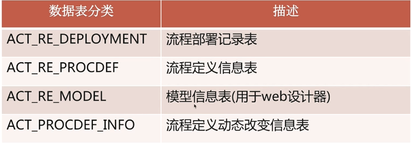

1. 流程部署表

   * ACT_RE_DEPLOYMENT【DeploymentEntityImpl】

     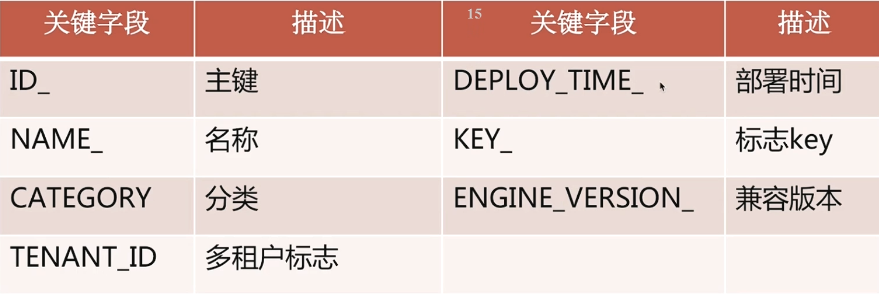

2. 流程定义表

   * ACT_RE_PROCDED【ProcessDefinitionEntityImpl】

     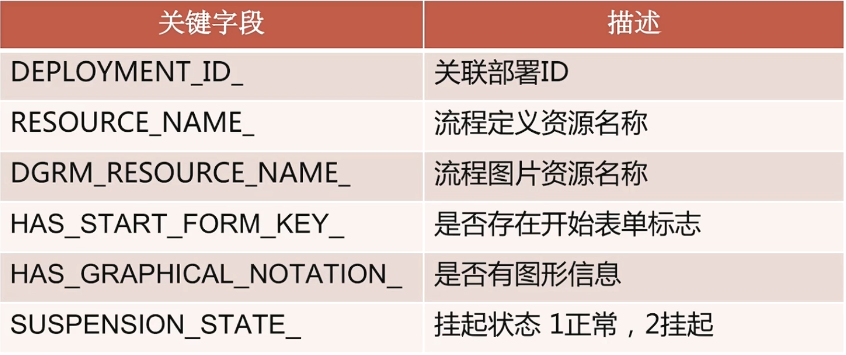

# 身份数据表

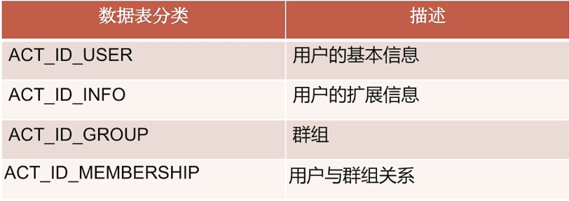

1. 用户信息表

   * ACT_ID_USER【UserEntityImpl】

     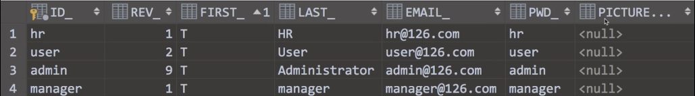

2. 用户扩展信息表

   * ACT_ID_INFO【IdentityInfoEntityImpl】

     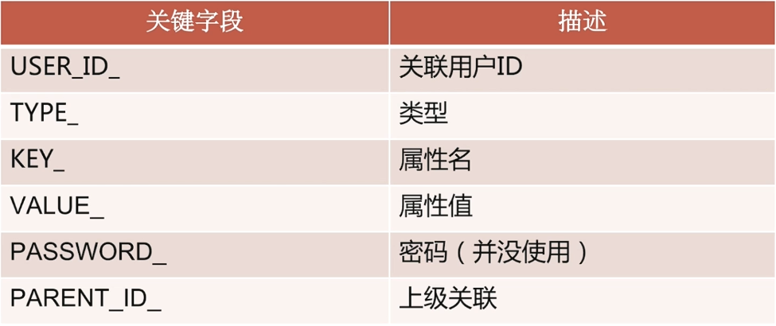

3. 用户组表

   * ACT_ID_GROUP 【GroupEntityImpl】

     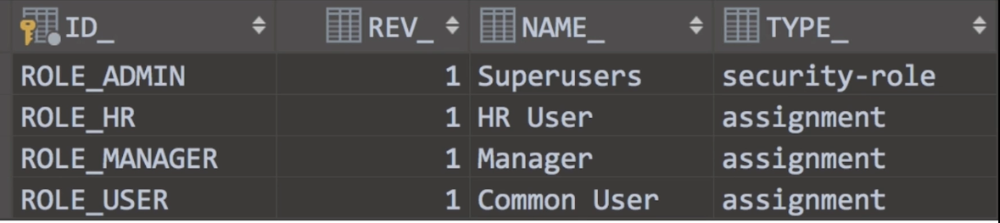

4. 用户组关系表

   * ACT_ID_MEMBERSHIP 【MembershipEntityImpl】

     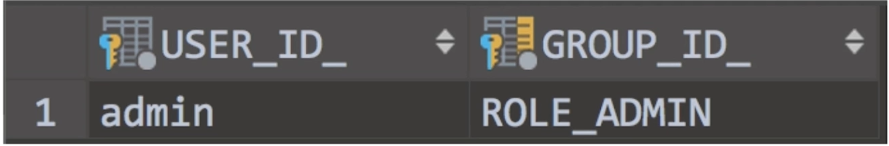

# 运行时流程数据表

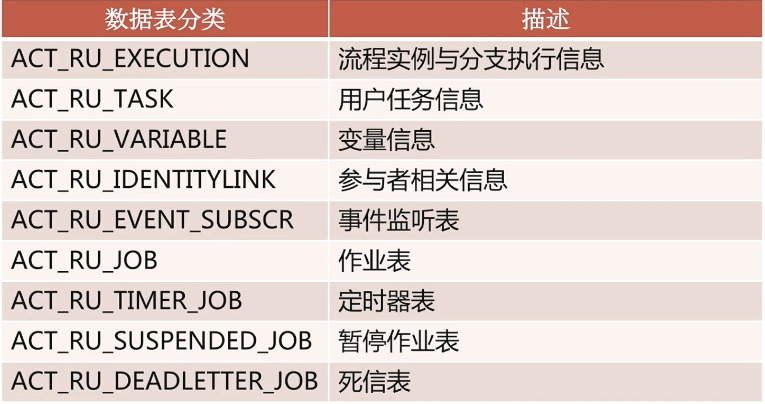

1. 流程实例执行表

   * ACT_RU_EXECUTION【ExecutionEntityImpl】

     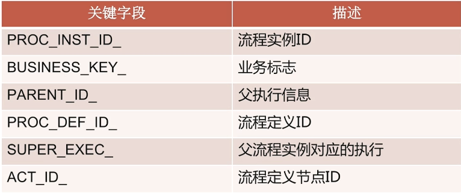

     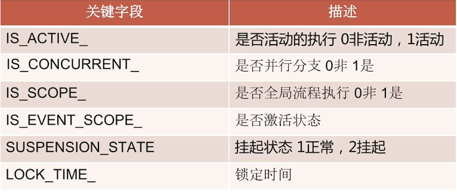

2. 用户任务表

   * ACT_RU_TASK 【TaskEntityImpl】

     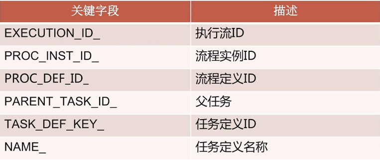

3. 变量信息表

   * ACT_RU_VARIABLE 【VariableInstanceEntityImpl】

     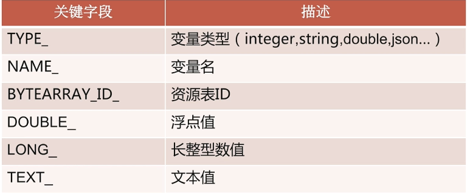

4. 参与者信息表

   * ACT_RU_IDENTITYLINK 【IdentityLinkEntityImpl】

     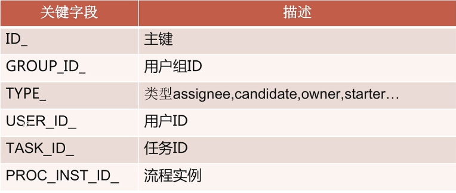

5. 事件订阅信息表

   * ACT_RU_EVENT_SUBSCR 【EventSubscriptionEntityImpl】

     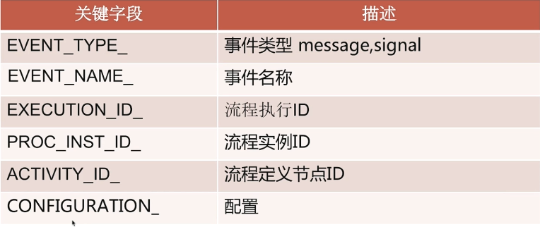

6. 作业信息表

   * ACT_RU_JOB 【JobEntityImpl】

     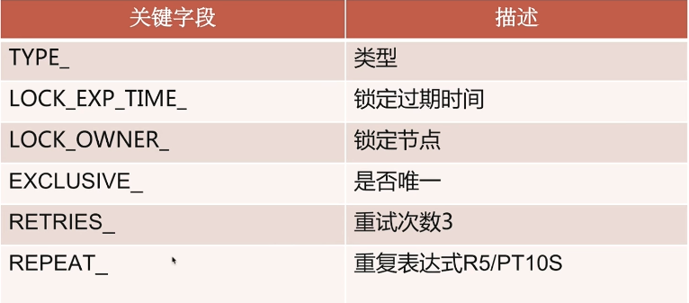

     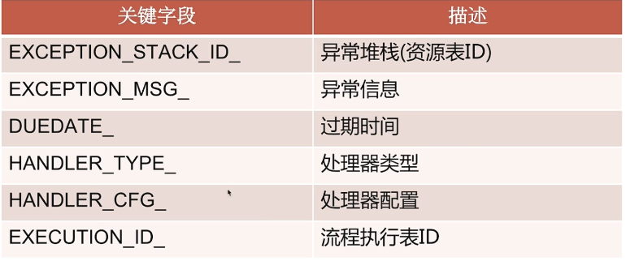

# 历史流程数据表

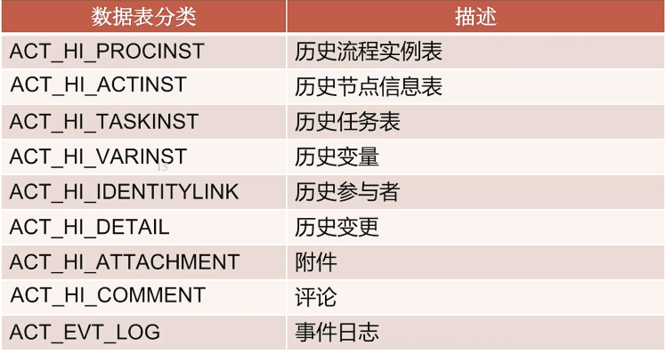

1. 历史流程实例表

   * ACT_HI_PROCINST 【HistoricProcessInstanceEntityImpl】

     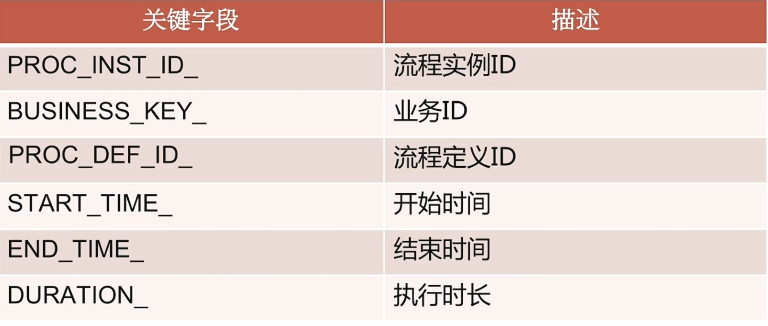

     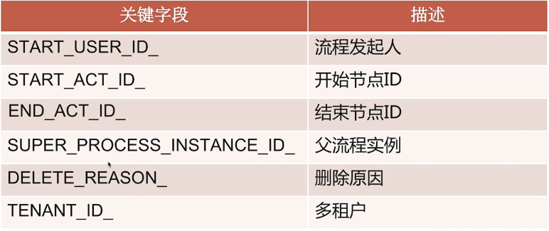

2. 事件日志表 (不可修改表，只能添加或删除)

   * ACT_EVT_LOG 【EventLogEntryEntityImpl】

     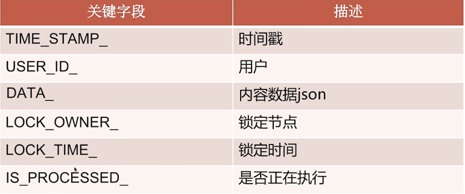

     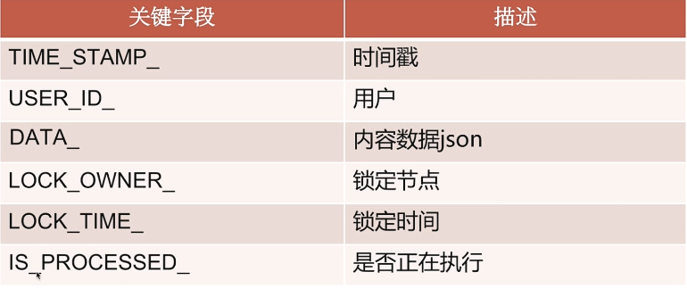

