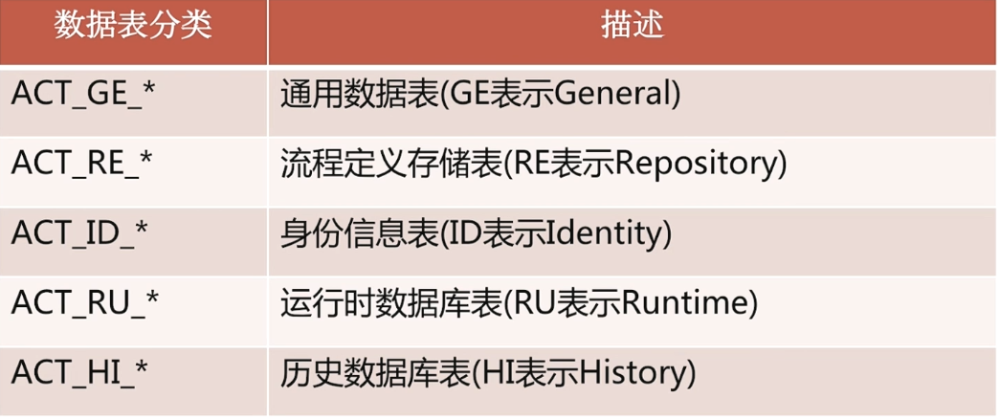

# 数据模型设计

# 数据库建表语句

1. MySql建表语句 (这里写了三种，因为Activit除了核心的定义引擎engine是必选的之外，其他的表都是可选)
   * 核心引擎activiti.mysql.create.engine.sql
   * 历史数据activiti.mysql.create.history.sql
   * 身份信息activiti.mysql.create.identity.sql
2. Mysql删表语句
   * 核心引擎activiti.mysql.drop.engine.sql
   * 历史数据activiti.mysql.drop.history.sql
   * 身份信息activiti.mysql.drop.identity.sql

# 通用数据库

1. ACT_GE_PROPERTY 【PropertyEntiotyImpl】

2.  ACT_GE_BYTEARRAY 【ByteArrayEntityImpl】

