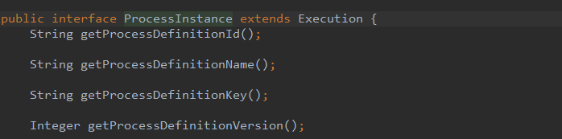
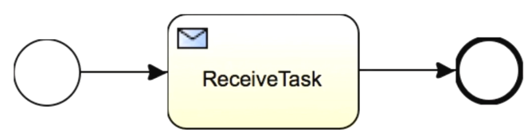
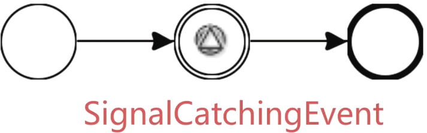
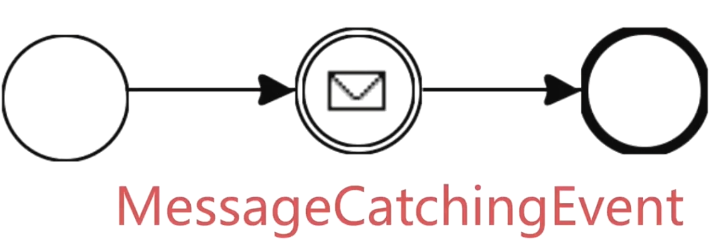

# 流程引擎以及服务

> ####  流程存储服务
>
> **RepositoryService**
>
> * 流程部署文件对象DeployMent
> * 流程定义文件对象ProcessDefinition
> * 流程定义的Java格式BpmnModel
>
> **流程部署代码**
>
> ```java
> /**
>      * @Description 流程部署
>      *
>      * @Author YuKai Fan
>      * @Date 22:13 2019/7/25
>      * @Param
>      * @return
>      **/
>     @Test
>     public void testRepository() {
>         RepositoryService repositoryService = activitiRule.getRepositoryService();
> 
>         DeploymentBuilder deploymentBuilder = repositoryService.createDeployment();
>         deploymentBuilder.name("测试部署资源1")
>                 .addClasspathResource("my-process.bpmn20.xml")
>                 .addClasspathResource("second_approve.bpmn20.xml");
> 
>         Deployment deploy = deploymentBuilder.deploy();
>         logger.info("deploy = {}", deploy);
> 
>         DeploymentBuilder deploymentBuilder1 = repositoryService.createDeployment();
>         deploymentBuilder1.name("测试部署资源2")
>                 .addClasspathResource("my-process.bpmn20.xml")
>                 .addClasspathResource("second_approve.bpmn20.xml");
>         deploymentBuilder1.deploy();
> 
> 
>         DeploymentQuery deploymentQuery = repositoryService.createDeploymentQuery();
>         //查询流程部署信息，与上面的deploy应该是一致的
>         List<Deployment> deployments = deploymentQuery.orderByDeploymenTime().asc()
>                 .listPage(0, 100);
>         for (Deployment deployment : deployments) {
>             logger.info("deployment = {}", deployment);
>         }
>         logger.info("deployments.size = {}", deployments.size());
>         //查询流程定义
>         List<ProcessDefinition> processDefinitions = repositoryService.createProcessDefinitionQuery()
> //                .deploymentId(deployment.getId())
>                 .orderByProcessDefinitionKey().asc()
>                 .listPage(0, 100);
>         for (ProcessDefinition processDefinition : processDefinitions) {
>             logger.info("processDefinition = {}, version = {}, key = {}, id = {}", processDefinition,
>                     processDefinition.getVersion(),
>                     processDefinition.getKey(),
>                     processDefinition.getId());
>         }
>     }
> ```
>
> **暂停/挂起 流程部署**
>
> ```java
> /**
>      * @Description 暂停/挂起 流程部署
>      *
>      * @Author YuKai Fan
>      * @Date  2019/7/25
>      * @Param
>      * @return
>      **/
>     @Test
>     @org.activiti.engine.test.Deployment(resources = {"my-process.bpmn20.xml"})
>     public void testSuspend(){
>         RepositoryService repositoryService = activitiRule.getRepositoryService();
> 
>         ProcessDefinition processDefinition = repositoryService.createProcessDefinitionQuery().singleResult();
>         logger.info("processDefinition.id = {}", processDefinition.getId());
> 
>         repositoryService.suspendProcessDefinitionById(processDefinition.getId());
>         try {
>             logger.info("开始启动");
>             activitiRule.getRuntimeService().startProcessInstanceById(processDefinition.getId());
>             logger.info("启动成功");
>         } catch (Exception e) {
>             logger.info("启动失败");
>             logger.info(e.getMessage(), e);
>         }
> 
>         repositoryService.activateProcessDefinitionById(processDefinition.getId());
>         logger.info("开始启动");
>     }
> ```
>
> **指定用户/用户组部署**
>
> ```java
>  /**
>      * @Description 指定用户或用户组部署
>      *
>      * @Author YuKai Fan
>      * @Date 22:14 2019/7/25
>      * @Param 
>      * @return 
>      **/
>     @Test
>     @org.activiti.engine.test.Deployment(resources = {"my-process.bpmn20.xml"})
>     public void testCandidateStarter(){
>         RepositoryService repositoryService = activitiRule.getRepositoryService();
> 
>         ProcessDefinition processDefinition = repositoryService.createProcessDefinitionQuery().singleResult();
> 
>         logger.info("processDefinition.id = {}", processDefinition.getId());
> 
>         repositoryService.addCandidateStarterUser(processDefinition.getId(), "user");
>         repositoryService.addCandidateStarterGroup(processDefinition.getId(), "groupM");
> 
>         //根据流程定义获取流程的关系
>         List<IdentityLink> identityLinks = repositoryService.getIdentityLinksForProcessDefinition(processDefinition.getId());
>         for (IdentityLink identityLink : identityLinks) {
>             logger.info("identityLink = {}", identityLink);
>         }
> 
>         //删除指定用户，用户组
>         repositoryService.deleteCandidateStarterGroup(processDefinition.getId(), "groupM");
>         repositoryService.deleteCandidateStarterUser(processDefinition.getId(), "user");
>     }
> ```
>


> #### 流程运行控制服务
>
> RuntimeService
>
>    * 启动流程以及对流程数据的控制
>
>         * 启动流程的常用方式(id, key, message)
>        
>        ``` java
>        /**
>                           * @Description 根据key启动流程
>                           * @Author YuKai Fan
>                           * @Date 20:22 2019/7/26
>                           * @Param
>                           * @return
>               **/
>              @Test
>              @org.activiti.engine.test.Deployment(resources = {"my-process.bpmn20.xml"})
>              public void testStartProcessByKey() {
>                  RuntimeService runtimeService = activitiRule.getRuntimeService();
>                  Map<String, Object> variables = Maps.newHashMap();
>                  variables.put("key1", "value1");
>          
>                  //通过key启动流程
>                  ProcessInstance processInstance = runtimeService.startProcessInstanceByKey("my-process", variables);
>                  logger.info("processInstance = {}", processInstance);
>              }
>        ```
>      
>        ``` java
>        /**
>                        * @Description 根据id启动流程
>               *
>                        * @Author YuKai Fan
>                        * @Date 20:22 2019/7/26
>                        * @Param
>                        * @return
>               **/
>              @Test
>              @org.activiti.engine.test.Deployment(resources = {"my-process.bpmn20.xml"})
>              public void testStartProcessById() {
>                  RepositoryService repositoryService = activitiRule.getRepositoryService();
>                  ProcessDefinition processDefinition = repositoryService.
>                          createProcessDefinitionQuery().
>                          singleResult();
>          
>                  RuntimeService runtimeService = activitiRule.getRuntimeService();
>                  Map<String, Object> variables = Maps.newHashMap();
>                  variables.put("key1", "value1");
>          
>                  //通过id启动流程
>                  ProcessInstance processInstance = runtimeService.startProcessInstanceById(processDefinition.getId(), variables);
>                  logger.info("processInstance = {}", processInstance);
>              }
>        ```
>      
>        ``` java
>         /**
>                        * @Description 根据ProcessInstanceBuilder启动流程
>               *
>                        * @Author YuKai Fan
>                        * @Date 20:22 2019/7/26
>                        * @Param
>                        * @return
>               **/
>              @Test
>              @org.activiti.engine.test.Deployment(resources = {"my-process.bpmn20.xml"})
>              public void testProcessInstanceBuilder() {
>                  RuntimeService runtimeService = activitiRule.getRuntimeService();
>                  Map<String, Object> variables = Maps.newHashMap();
>                  variables.put("key1", "value1");
>          
>                  ProcessInstanceBuilder processInstanceBuilder = runtimeService.createProcessInstanceBuilder();
>                  ProcessInstance processInstance = processInstanceBuilder.businessKey("businessKey001")
>                          .processDefinitionKey("my-process")
>                          .variables(variables)
>                          .start();
>          
>                  logger.info("processInstance = {}", processInstance);
>              }
>        ```
>      
>        ``` java
>        /**
>                           * @Description 基于message启动流程
>               *
>                           * @Author YuKai Fan
>                           * @Date 21:01 2019/7/26
>                           * @Param
>                           * @return
>               **/
>              @Test
>              @org.activiti.engine.test.Deployment(resources = {"my-process-message.bpmn20.xml"})
>              public void testMessageStart() {
>                  RuntimeService runtimeService = activitiRule.getRuntimeService();
>          
>                  /*基于message方式启动流程，会在数据库事件订阅表中插入一条记录
>                    这种方式是根据消息信号的方式在事件订阅中找到订阅信号的id，再根据id找到流程定义的key，再根据key启动流程
>                   */
>                  ProcessInstance processInstance = runtimeService
>          //                .startProcessInstanceByKey("my-process");
>                          .startProcessInstanceByMessage("my-message");
>          
>                  logger.info("processInstance = {}", processInstance);
>          
>          
>          
>              }
>        ```
>      
>        
>      ​     
>         * 启动流程可选参数(businessKey, variables, tenantId)
>         
>        ``` java
>        /**
>                           * @Description 启动的流程中修改变量
>                           * @Author YuKai Fan
>                           * @Date 20:22 2019/7/26
>                           * @Param
>                           * @return
>               **/
>              @Test
>              @org.activiti.engine.test.Deployment(resources = {"my-process.bpmn20.xml"})
>              public void testVariables() {
>                  RuntimeService runtimeService = activitiRule.getRuntimeService();
>                  Map<String, Object> variables = Maps.newHashMap();
>                  variables.put("key1", "value1");
>                  variables.put("key2", "value2");
>          
>                  //通过key启动流程
>                  ProcessInstance processInstance = runtimeService.startProcessInstanceByKey("my-process", variables);
>                  logger.info("processInstance = {}", processInstance);
>          
>                  //添加新的变量
>                  runtimeService.setVariable(processInstance.getId(), "key3", "value3");
>                  //对key2的变量进行修改
>                  runtimeService.setVariable(processInstance.getId(), "key2", "value2-1");
>                  //获取执行任务的变量
>                  Map<String, Object> variables1 = runtimeService.getVariables(processInstance.getId());
>                  logger.info("variables1 = {}", variables1);
>          
>              }
>        ```
>      
>        
>      ​     
>        
>         * 变量(variables)的设置和获取
>
>
> ​     
>
>    * 流程实例(ProcessInstance)与执行流(Execution，可以查询到当前流程执行到哪一步)查询
>
>         * 流程实例与执行流
>
> ~~~java
> /**
>            * @Description 查询流程执行对象
>            * @Author YuKai Fan
>            * @Date 20:22 2019/7/26
>            * @Param
>            * @return
> **/
> @Test
> @org.activiti.engine.test.Deployment(resources = {"my-process.bpmn20.xml"})
> public void testExecutionQuery() {
>   RuntimeService runtimeService = activitiRule.getRuntimeService();
>   Map<String, Object> variables = Maps.newHashMap();
>   variables.put("key1", "value1");
>   variables.put("key2", "value2");
> 
>   //通过key启动流程
>   ProcessInstance processInstance = runtimeService.startProcessInstanceByKey("my-process", variables);
>   logger.info("processInstance = {}", processInstance);
> 
>   //根据流程实例id获取执行对象流标
>   List<Execution> executions = runtimeService.createExecutionQuery()
>           .processInstanceId(processInstance.getId())
>           .listPage(0, 100);
> 
>   for (Execution execution : executions) {
>       logger.info("execution = {}", execution);
>   }
> }
> ~~~
>
>
> ​    
>
>  * 流程实例(ProcessInstance)表示一次工作流业务的数据实体
>
>      * 执行流(Execution)表示流程实例中具体的执行路径
>
>      * 流程实例接口继承与执行流，也就是流程实例在执行流的基础上扩展的操作
>
> 
>
>    * 触发流程操作，接收消息
>
>         * 使用trigger触发ReceiveTask节点
>         
>           
>         
>           ``` java
>           /**
>                     * @Description 使用trigger触发ReceiveTask节点
>                    *
>                     * @Author YuKai Fan
>                       * @Date 21:01 2019/7/26
>                       * @Param 
>                       * @return 
>                    **/
>                   @Test
>                   @org.activiti.engine.test.Deployment(resources = {"my-process-trigger.bpmn20.xml"})
>                   public void testTrigger() {
>                       RuntimeService runtimeService = activitiRule.getRuntimeService();
>                       ProcessInstance processInstance = runtimeService.startProcessInstanceByKey("my-process");
>               
>                       Execution execution = runtimeService.createExecutionQuery()
>                               .activityId("someTask")
>                               .singleResult();
>                       logger.info("execution = {}", execution);
>               
>                       runtimeService.trigger(execution.getId());
>                       execution = runtimeService.createExecutionQuery()
>                               .activityId("someTask")
>                               .singleResult();
>                       logger.info("execution = {}", execution);
>                   }
>           ```
>         
>           
>         
>         * 触发信号捕获事件signalEventReceive
>         
>           
>         
>           ``` java
>           /**
>                   * @Description 触发信号捕获事件signalEventReceived
>                *
>                   * @Author YuKai Fan
>                   * @Date 21:01 2019/7/26
>                   * @Param
>                   * @return
>                **/
>               @Test
>               @org.activiti.engine.test.Deployment(resources = {"my-process-signal-received.bpmn20.xml"})
>               public void testSignalEventReceived() {
>                   RuntimeService runtimeService = activitiRule.getRuntimeService();
>                   ProcessInstance processInstance = runtimeService.startProcessInstanceByKey("my-process");
>           
>                   Execution execution = runtimeService.createExecutionQuery()
>                           .signalEventSubscriptionName("my-signal")
>                           .singleResult();
>                   logger.info("execution = {}", execution);
>           
>                   runtimeService.signalEventReceived("my-signal");
>           
>                   execution = runtimeService.createExecutionQuery()
>                           .signalEventSubscriptionName("my-signal")
>                           .singleResult();
>                   logger.info("execution = {}", execution);
>              }
>           ```
>         
>           
>         
>         * 触发消息捕获事件messageEventReceived    
>         
>           
>         
>           ``` java
>           /**
>                   * @Description 触发消息捕获事件messageEventReceived
>                *
>                   * @Author YuKai Fan
>                   * @Date 21:01 2019/7/26
>                   * @Param
>                   * @return
>                **/
>               @Test
>               @org.activiti.engine.test.Deployment(resources = {"my-process-message-received.bpmn20.xml"})
>               public void testMessageEventReceived() {
>                   RuntimeService runtimeService = activitiRule.getRuntimeService();
>                   ProcessInstance processInstance = runtimeService.startProcessInstanceByKey("my-process");
>           
>                   Execution execution = runtimeService.createExecutionQuery()
>                           .messageEventSubscriptionName("my-message")
>                           .singleResult();
>                   logger.info("execution = {}", execution);
>           
>                   //这是消息触发与信号触发的不同点，消息触发必须要执行id
>                   runtimeService.messageEventReceived("my-message", execution.getId());
>           
>                   execution = runtimeService.createExecutionQuery()
>                           .messageEventSubscriptionName("my-message")
>                           .singleResult();
>                   logger.info("execution = {}", execution);
>           
>               }
>           ```
>
>
> ​    
>

